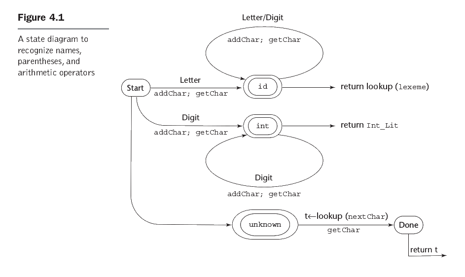

# Análise Léxica usando Diagram de Estados

Uma outra abordagem para a construção de um analisador léxico é utilizar um diagrama de transição de estados. O diagrama de transição de estados é um grafo direcionado. Cada nó do grafo representa um estado do diagrama e os arcos são rotulados com caracteres da entrada que causam a transição entre os estados.



Na Figura 4.1, os estados estão rotulados com o nome do token e os arcos estão rotulados na parte de cima do arco com a classe de caracteres da entrada que causam a transição. Observe que **Letter** é uma classe de caracteres associado com as letras 'a' até 'z' e 'A' até 'Z' e **Digit** é uma classe de caracteres associado com os caracteres '0' até '9'. Na parte de baixo do arco, temos as ações realizadas pelo analisador léxico na implementação do analisador. Observe que o analisador acima, só aceita constantes númericas inteiras. Ele precisaria ser estendido para aceitar números pontos flutuantes e/ou constantes hexadecimais.

Considere o seguinte trecho de código:
```ADA
    IF quantity THEN 
        total := total + price *quantity; 
    ENDIF;
```

O seguinte código Python seria uma implementação direta das idéias apresentadas pela Figura 4.1. Cada condicional da função ```get_token()``` reconhece um tipo de token diferente. 

```Python
import sys

class Token():
  def __init__(self,type, value, line):
    self.type = type
    self.value = value
    self.line = line
    
  def __str__(self):
    return "Token(type='%s', value='%s', line=%d)" % (self.type, self.value,self.line) 

pos     = 0
token_atual = ""
proximoCaracter = ' '
line_num = 0

def pegaCaracter():
  global pos  
  global proximoCaracter
  if pos == len(code):
    proximoCaracter = '$'  
  else:
    proximoCaracter = code[pos] 
  pos = pos + 1

  
def acrescentaCaracter():
  global token_atual  
  token_atual = token_atual + proximoCaracter
     

def get_token():  
  global token_atual  
  global pos  
  global line_num
     
  keywords = {'IF', 'THEN', 'ENDIF', 'FOR', 'NEXT', 'GOSUB', 'RETURN'}

  pegaCaracter()
  while proximoCaracter == ' ' or proximoCaracter == '\n' or proximoCaracter == '\t' :
    if proximoCaracter == '\n':
      line_num = line_num + 1
    pegaCaracter()

  if proximoCaracter == '+':
    acrescentaCaracter()
    kind = 'OP'
    value = token_atual
  elif proximoCaracter == '*':
    acrescentaCaracter()
    kind = 'OP'
    value = token_atual
  elif proximoCaracter == ';':
    acrescentaCaracter()
    kind = 'END'
    value = token_atual
  elif proximoCaracter == '$':
    kind = 'EOF'
    value = token_atual
  elif proximoCaracter.isalpha() :
    acrescentaCaracter()
    pegaCaracter()
    while proximoCaracter.isalpha() or proximoCaracter.isdigit() :
      acrescentaCaracter()
      pegaCaracter()
    pos = pos - 1    
    if token_atual in keywords:
      kind = token_atual
      value = token_atual  
    else:
      kind = 'ID'
      value = token_atual  
  elif proximoCaracter == ':':
      acrescentaCaracter()
      pegaCaracter()                
      if proximoCaracter == '=':      
        acrescentaCaracter()      
      kind = 'ASSIGN'
      value = token_atual
  else:
    kind = 'MISMATCH'
    value = ''             
  token_atual = ""  
  return Token(kind, value, line_num)  


data = sys.stdin.readlines()

code = ''.join(data)

print(code)

token = get_token()
while  token.type != 'EOF':
  print(token)
  token = get_token()

```

O código acima, reconhece os seguintes tokens:


```
Token(type='IF', value='IF', line=0)
Token(type='ID', value='quantity', line=0)
Token(type='THEN', value='THEN', line=0)
Token(type='ID', value='total', line=1)
Token(type='ASSIGN', value=':=', line=1)
Token(type='ID', value='total', line=1)
Token(type='OP', value='+', line=1)
Token(type='ID', value='price', line=1)
Token(type='OP', value='*', line=1)
Token(type='ID', value='quantity', line=1)
Token(type='END', value=';', line=1)
Token(type='ENDIF', value='ENDIF', line=2)
Token(type='END', value=';', line=2)
```


Agora, chegou a sua vez de fazer a analisador léxico. Modifique o código acima para fazer a análise léxica do seguinte código:

```C
if(quantity){ 
  total = total + price * quantity; 
}
```

Produzindo a seguinte saída:
```
Token(type='if', value='if', line=0)
Token(type='(', value='(', line=0)
Token(type='ID', value='quantity', line=0)
Token(type=')', value=')', line=0)
Token(type='{', value='{', line=0)
Token(type='ID', value='total', line=1)
Token(type='ASSIGN', value='=', line=1)
Token(type='ID', value='total', line=1)
Token(type='OP', value='+', line=1)
Token(type='ID', value='price', line=1)
Token(type='OP', value='*', line=1)
Token(type='ID', value='quantity', line=1)
Token(type='END', value=';', line=1)
Token(type='}', value='}', line=2)
```


