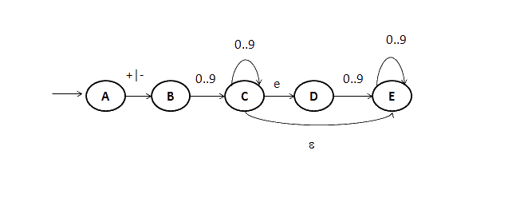

# Autômato Finito 

O autômato finito ou o digrama de estados é uma ótima ferramenta para reconhecer tokens de uma linguagem. Assinale quantas sequências de caracteres a seguir são reconhecidas pelo autômato finito abaixo. As quatros sequências de caracteres (separados por vírgulas) são: 0, +567, -89.5, -3e3. O estado E é o estado final e o estado A é o estado inicial. Nesse autômato, temos uma transição de C para E com o caractere vazio. Isso indica que não precisa lido nenhum caractere para ir do estado C para E. 

a. 0
b. 2
c. 4
d. 1
e. 3

